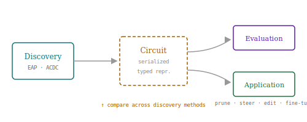
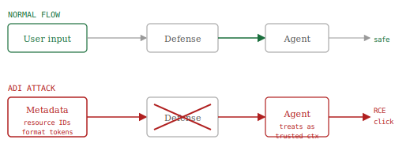
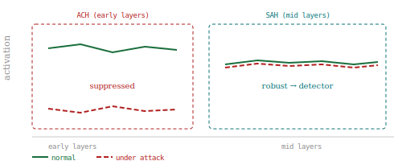

# Research Radar — July 22, 2026

> **Mech Interp · AI Security · Text Diffusion LMs** | Daily edition
> **HTML artifact:** https://claude.ai/code/artifact/7956d8c7-500b-4c85-ad4c-5ef9c8784e58

**Window:** July 20–22, 2026 (latest preprints); back-swept through May 2026 for field-relevant work not previously surfaced
**Sources swept:** OpenReview · ACL Anthology · arXiv (cs.CL / cs.LG / cs.CR / cs.AI) · Semantic Scholar · HuggingFace Papers · GitHub · The Hacker News
**Counts:** 0 peer-reviewed · 10 preprints · 0 forum/blog

---

## 01 · [CircuitKIT: Circuit Discovery, Evaluation, and Application Toolkit for Mechanistic Interpretability](https://arxiv.org/abs/2607.19317)

`mech-interp` `preprint` — Pratinav Seth, Hem Gosalia, Aditya Kasliwal, Vinay Kumar Sankarapu — arXiv, July 21, 2026

Mech-interp circuit work has long been hampered by the absence of shared infrastructure — researchers stitch together bespoke discovery scripts, hand-written evaluation loops, and ad hoc application code with no common representation tying them together. CircuitKIT ships all of that as one typed, serializable library: discover a circuit with EAP, evaluate its faithfulness, apply it to steer or prune the model, and compare results across methods without any format translation.

*CircuitKIT's unified pipeline: a typed, serializable circuit representation connects discovery algorithms (EAP, ACDC, and others) to evaluation diagnostics and downstream applications — pruning, editing, steering, fine-tuning — without format translation between stages.*

CircuitKIT introduces a typed, serializable circuit representation that connects every stage of the circuit-analysis workflow: a suite of discovery algorithms, declarative interfaces for mapping structured datasets into discovery tasks, faithfulness and completeness diagnostics, and downstream application modules. Because circuits are serialized, results from different discovery methods are directly comparable. Adding a new discovery algorithm requires implementing a single typed interface.

---

## 02 · [Agent Data Injection Attacks are Realistic Threats to AI Agents](https://arxiv.org/abs/2607.05120)

`AI security` `preprint` — Woohyuk Choi, Juhee Kim, Taehyun Kang et al. (Seoul National University · UIUC) — arXiv, July 6, 2026

Every current defense against prompt injection watches for injected *instructions*. This paper shows that hiding the attack inside metadata fields and format tokens — content the agent treats as structurally authoritative, not adversarial — bypasses all of those defenses. The authors demonstrate arbitrary click attacks on Claude in Chrome and remote code execution on Claude Code and Gemini CLI without touching a single instruction-style payload.

*ADI vs. normal flow: defenses inspect instruction-style content (top — blocked). ADI payloads ride in metadata fields and format tokens the agent treats as authoritative context — the defense never fires (red ✕), and the agent executes malicious actions.*

ADI injects malicious data disguised as trusted agent-context material: security-critical metadata (resource identifiers, data-origin fields) or tool-call/response format tokens. Because agents treat this content as structurally authoritative rather than as untrusted instructions, existing defenses do not fire. The authors demonstrate arbitrary click attacks on web agents (Claude in Chrome, Antigravity, Nanobrowser) and RCE / supply-chain attacks on coding agents (Claude Code, Codex, Gemini CLI). ⚠️ Setup-file content is now an active attack surface.

---

## 03 · [Robust Harmful Features Under Jailbreak Attacks: Mechanistic Evidence from Attention Head Specialization in Large Language Models](https://arxiv.org/abs/2606.28153)

`mech-interp` `AI security` `preprint` — Yanchen Yin, Dongqi Han, Linghui Li — arXiv, June 26, 2026

Jailbreaks don't eliminate the model's internal safety signal — they selectively suppress the specific early-layer attention heads that act as its gatekeeper, while mid-layer safety heads remain fully active throughout. That asymmetry turns out to be a detection opportunity: reading the mid-layer heads' activations, without any fine-tuning, yields competitive jailbreak detection that holds up under adversarial pressure.

*Adversarially Compromised Heads (ACH, early layers) are suppressed when attacks succeed — driven by attack-template tokens, not harmful content. Safety-Aligned Heads (SAH, mid layers) remain active regardless, making their activations a training-free jailbreak detector.*

Two functionally distinct attention head classes: ACHs (early layers, suppressed by attacks) and SAHs (mid-layers, robust even during successful jailbreaks). Token-level attribution reveals ACH suppression is driven by attack-template tokens — formatting alone bypasses refusal. Ablation studies confirm causal necessity: suppressing a small number of ACHs induces jailbreak-like behavior on normally refused inputs. SAH activations yield competitive jailbreak detection with strong adversarial robustness, no training required.

---

## Items 4–10

**04 · [AgentLens: Interpretable Safety Steering via Mechanistic Subspaces for Multi-Turn Coding Agents](https://arxiv.org/abs/2606.22673)**
`mech-interp` `AI security` — Weidi Luo et al. — arXiv, June 27, 2026
10-dimensional subspace intervention per agent step catches harmful intent before tool execution; introduces the MAS benchmark (194 annotated multi-turn trajectories across LLaMA-3.1-8B, Qwen-2.5-7B, Gemma-2-9B).

**05 · [Steering Without Breaking: Mechanistically Informed Interventions for Discrete Diffusion LMs](https://arxiv.org/abs/2605.10971)**
`dLLM` `mech-interp` — Hanhan Zhou, Shamik Roy, Rashmi Gangadharaiah (AWS AI Labs) — arXiv, May 8, 2026
SAEs on dLLM denoising trajectories show topic locks in within 2% of steps; sentiment drifts over 20%. Adaptive steering at the right window beats uniform baselines on all four tested models (124M–8B parameters).

**06 · [Many Circuits, One Mechanism: Input Variation and Evaluation Granularity in Circuit Discovery](https://arxiv.org/abs/2606.06267)**
`mech-interp` — Alireza Bayat Makou et al. — arXiv, June 4, 2026
"Phantom specialization": circuits discovered under different input distributions look structurally distinct but implement the same computation. Source-level evaluation is the culprit; edge-level evaluation reveals the many-to-one mapping.

**07 · [Subspace-Aware Sparse Autoencoders (SASA) for Effective Mechanistic Interpretability](https://arxiv.org/abs/2606.06333)**
`mech-interp` — arXiv, June 4, 2026
Replaces each SAE decoder vector with a learned low-rank subspace + block sparsity. Feature absorption drops substantially on GPT-2 Small and Mistral-7B at roughly half the token budget of standard SAEs.

**08 · [The Balkanization of Execution-Security Research for AI Coding Agents](https://arxiv.org/abs/2607.05743)**
`AI security` — Mohammadreza Rashidi — arXiv, July 5, 2026
Systematic review of 39 papers across 17 categories; policy-enforcement failure rates of 69–98% are the headline. Documents 4 patched CVEs and 5 structural gaps in the fragmented research landscape.

**09 · [A Geometric View for Understanding Concept Learning and Neuron Interpretation in Sparse Autoencoders](https://arxiv.org/abs/2606.07007)**
`mech-interp` — Chenhao Zhang, Chris Lin, Su-In Lee — arXiv, June 5, 2026
Formal unified framework for SAE concept learning: three learning notions (detection, separation, approximation), capacity constraints on SAE size, and set-theoretic derivations for why feature splitting and absorption occur.

**10 · [Adaptive Evaluation of Out-of-Band Defenses Against Prompt Injection in LLM Agents](https://arxiv.org/abs/2606.26479)**
`AI security` — Praneeth Narisetty et al. — arXiv, June 25, 2026
Second-gen out-of-band defenses (CaMeL, FIDES, Progent, RTBAS, FORGE) look strong on AgentDojo — but adaptive attackers expose the same gap as early SQL-sanitization benchmarks did for SQLi.

---

## Notes

- **Only one entry from the strict July 20–22 window:** #1 (CircuitKIT, July 21). The remaining nine are field-relevant papers from May–June 2026 not previously surfaced by this radar.
- **Cross-topic standout:** #5 (Steering Without Breaking) is the first SAE-based mech-interp study of dLLM denoising schedules.
- **Security-mech-interp cluster:** #3 (ACH/SAH specialization), #4 (AgentLens), and #2 (ADI attacks) all advance practical agent/LLM security with interpretability-adjacent findings or real-world exploit demonstrations.
- **Dual-use flag:** #2 (ADI) demonstrates RCE on Claude Code and Gemini CLI via only documentation edits; setup-file content is an active attack surface.
