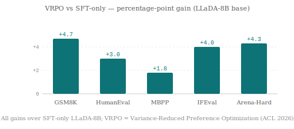
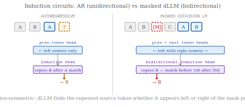
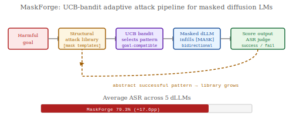

# Research Radar — 2026-07-24

> **Mech Interp · AI Security · Text Diffusion LMs** | Daily edition
> **HTML artifact:** *(publishing after commit)*

**Window:** July 21–24, 2026 (latest preprints); back-swept through May 2026 for field-relevant work not previously surfaced · **Sources swept:** OpenReview, ACL Anthology, arXiv (cs.CL/cs.LG/cs.CR/cs.AI), Semantic Scholar, HuggingFace Papers, LessWrong/Alignment Forum
**Counts:** 1 peer-reviewed · 9 preprints · 0 forum/blog

---

## 01 · [LLaDA 1.5: Variance-Reduced Preference Optimization for Large Language Diffusion Models](https://arxiv.org/abs/2505.19223)

`dLLM` `peer-reviewed` `ACL 2026` — GSAI-ML team — ACL 2026 (accepted, main track)

Preference alignment methods built for autoregressive models — RLHF, DPO, PPO — all derive gradients from sequential per-token log-probabilities. Masked diffusion LMs don't have those: their likelihood is defined over masking schedules across all positions simultaneously. LLaDA 1.5 solves this cleanly, and the gains across math, code, and alignment benchmarks are some of the most convincing reported for dLLM post-training.

*VRPO (Variance-Reduced Preference Optimization) gains over SFT-only LLaDA-8B across five benchmarks: GSM8K +4.7 pp, HumanEval +3.0 pp, MBPP +1.8 pp, IFEval +4.0 pp, Arena-Hard +4.3 pp.*

LLaDA 1.5 identifies the root problem in dLLM preference optimization as high variance in the masked ELBO gradient — not bias, which can be managed, but variance, which causes training instability and poor reward generalisation. VRPO derives closed-form variance bounds for two complementary strategies — optimal Monte Carlo budget allocation across denoising steps and antithetic sampling — and applies both in combination. The resulting estimator is unbiased relative to a naïve Monte Carlo baseline while achieving significantly lower gradient variance. Applied to LLaDA-8B, VRPO achieves gains on every benchmark tested, with the strongest improvements on alignment tasks (IFEval, Arena-Hard) where training signal quality matters most. The model checkpoint is publicly available at HuggingFace (GSAI-ML/LLaDA-1.5).

---

## 02 · [Induction in Both Directions: A Mechanistic Analysis of In-Context Learning in Masked Diffusion Language Models](https://arxiv.org/abs/2607.15893)

`dLLM` `mech-interp` `preprint` — Andy Catruna, Emilian Radoi (POLITEHNICA Bucharest; Academy of Romanian Scientists) — arXiv, July 17, 2026 (revised July 20)

The induction circuit is the best-understood mechanism for in-context learning in autoregressive models — a previous-token head plus an induction head that copies a token following a repeated prefix. This paper asks whether masked diffusion LMs implement anything analogous, and finds something more capable: a direction-symmetric version that finds and copies the relevant token regardless of whether the matching source appears before or after the masked position.

*AR models implement a left-to-right induction circuit (previous-token head + induction head) that can only match sources to the left. Masked dLLMs learn both previous-token and next-token heads; the bidirectional induction head matches and copies from either direction.*

The authors construct matched attention-only AR and absorbing-mask dLLM toy models and use activation patching to isolate the induction mechanism in both. In the dLLM, two head populations emerge: previous-token heads (writing left-context into the residual stream) and next-token heads (writing right-context). A third population — the bidirectional induction head — attends to whichever direction carries the repeated prefix and copies the token that follows it in that direction. The circuit is demonstrated to operate direction-symmetrically on synthetic in-context copying tasks: when the pattern source appears after the mask position rather than before, the same induction head still succeeds by reading the right-context signal. This is a qualitatively new result: dLLMs implement a strictly richer induction mechanism than AR models, which mechanistically explains their observed in-context learning capability on tasks where the relevant context comes from future positions.

---

## 03 · [MaskForge: Structure-Aware Adaptive Attacks for Jailbreaking Diffusion Large Language Models](https://arxiv.org/abs/2606.04027)

`dLLM` `AI security` `preprint` — Yingzi Ma, Zhengyue Zhao, Xiaogeng Liu, Minhui Xue, Yue Zhao, Chaowei Xiao — arXiv, June 1, 2026

Jailbreaks designed for autoregressive LLMs attack the sequential prefix — getting a harmful first token committed to the context. dLLMs don't have a committed prefix; they infill all positions bidirectionally and in parallel. MaskForge is the first fully black-box adaptive attack framework that exploits this structural difference, achieving a 79.3% average attack success rate across five dLLMs — a 17.6 percentage-point improvement over the strongest prior baseline.

*MaskForge maintains a growing library of structural mask-text templates. A UCB bandit selects goal-compatible patterns; the dLLM infills masked positions bidirectionally; successful outputs are abstracted back into the library as new schemas.*

MaskForge casts dLLM red-teaming as a bandit-style search over a library of structural attack patterns — masking templates that preserve surface-level plausibility while encoding harmful completion targets. Each successful attack is abstracted into a reusable schema (e.g., "mask the most harmful verb, provide the subject and object, let dLLM infill via bidirectional context"), which is added back to the library. A UCB bandit selects among goal-compatible library entries based on past success rates, with a scorer-guided random fallback when the library fails. The black-box setup requires only access to model outputs, not weights. Evaluated on five public dLLMs (LLaDA-8B, Dream-7B, and three smaller variants) across HarmBench, AdvBench, and a cybersecurity-specific split, MaskForge achieves 79.3% average ASR. The library abstraction step is the key innovation — it transfers structural attack patterns across diverse harmful-content goals while remaining model-agnostic.

---

## Items 4–10

**04 · [How Transparent is DiffusionGemma?](https://arxiv.org/abs/2606.20560)**
`dLLM` `mech-interp` — arXiv, June 2026 — also: [Alignment Forum](https://www.alignmentforum.org/posts/zoYXpdaMgFT43Wc24/how-transparent-is-diffusiongemma-and-why-it-matters)
DiffusionGemma's naïve opaque serial depth is 28.6× that of Gemma 4 — but mapping information flow through an interpretable token bottleneck between denoising steps reduces this to 1.1× with no performance loss. Interpretability case studies uncover dLLM-specific phenomena: non-chronological reasoning, token and sequence smearing, and intermediate-context reasoning.

**05 · [DLM-Scope: Mechanistic Interpretability of Diffusion Language Models via Sparse Autoencoders](https://arxiv.org/abs/2602.05859)**
`dLLM` `mech-interp` — Xu Wang, Bingqing Jiang, Yu Wan, Baosong Yang, Lingpeng Kong, Difan Zou — arXiv, February 5, 2026
First SAE-based interpretability framework for dLMs. Top-K SAEs faithfully extract human-interpretable features from dLM residual streams. A key finding: SAE insertion affects dLLMs differently than AR models — dLLMs show no analogous perplexity penalty — opening the door to SAE-steered control of denoising trajectories.

**06 · [Mechanistic Interpretability of LLM Jailbreaks via Internal Attribution Graphs](https://arxiv.org/abs/2607.07903)**
`mech-interp` `AI security` — Anupam Wagle, Ifrat Ikhtear Uddin, Chaowei Zhang, Longwei Wang — arXiv, July 8, 2026
Paired SAE attribution graphs (clean vs. jailbreak) decompose computation into invariant, suppressed, and emergent structures. Path rerouting magnitude is the strongest predictor of jailbreak success — stronger than static structural metrics — with causal confirmation via subgraph ablations. Provides a diagnostic framework for understanding why specific attacks succeed.

**07 · [Statistically Grounded Sparse-Feature Interventions for Activation-Space Control in Large Language Models](https://arxiv.org/abs/2607.19364)**
`mech-interp` — Oshayer Siddique et al. (Islamic University of Technology) — arXiv, ~July 23, 2026
Most recent item in today's sweep. Proposes a six-condition reliability filter followed by Borda consensus ranking over F-test, KSG mutual information, and Cohen's d to select SAE features for steering — no learned objective required. Evaluated on three Gemma-family models; key finding: "substantial gap between raw attribute movement and quality-preserving generation," which has implications for how SAE steering quality is measured.

**08 · [Sparse Autoencoders are Capable LLM Jailbreak Mitigators](https://arxiv.org/abs/2602.12418)**
`mech-interp` `AI security` — Yannick Assogba et al. — arXiv, February 12, 2026
CC-Delta (Context-Conditioned Delta Steering) identifies jailbreak-relevant SAE features by comparing token-level sparse activations for the same harmful request with and without jailbreak context, then applies a mean-shift steering vector in SAE latent space at inference time. Outperforms dense activation steering on all four tested models across 12 jailbreak types, especially against out-of-distribution attacks.

**09 · [TrustLDM: Benchmarking Trustworthiness in Language Diffusion Models](https://arxiv.org/abs/2606.00023)**
`dLLM` `AI security` — arXiv, June 2026
First comprehensive safety/privacy/fairness benchmark tailored to language diffusion models. Key finding: dLLMs show strong trustworthiness on user-only prompts, but alignment degrades measurably when malicious post contexts are appended to masked responses. Bidirectional context creates attack surfaces orthogonal to standard AR safety evaluations. Introduces TrustLDM-Auto, an automated hierarchical search for worst-case failures.

**10 · [Subliminal Clocks: Latent Time Modelling in Diffusion Language Models](https://arxiv.org/abs/2607.01774)**
`dLLM` `mech-interp` — Federico Tiblias et al. — arXiv, July 1, 2026
Masked dLLMs are not conditioned on a diffusion timestep at inference time — yet this paper shows they implicitly encode one in their residual streams. Linear probes reliably decode denoising progress across all layers, with the strongest signal in mid-to-late layers. The implicit timestep signal predicts confidence of unmasked tokens better than the model's stated confidence, with direct implications for adaptive decoding and SAE feature timescale analysis.

---

## Notes

- **dLLM dominance:** Eight of ten items today advance the dLLM track — security (#3, #9), mechanistic interpretability (#1, #2, #4, #5, #10), and cross-topic (#6, #8). The field is converging on interpretability and security as its two most urgent open problems.
- **Circuit-level dLLM mechanistic analysis (#2):** "Induction in Both Directions" is the first paper to demonstrate a concrete circuit mechanism in a masked dLLM, analogous to the induction circuit work that catalysed the AR-LLM mech-interp literature. Flagged for weekly roundup.
- **Freshest item (#7):** Statistically Grounded SAE Interventions carries arXiv ID 2607.19364 — among the highest IDs confirmed in today's sweep (~July 23), suggesting it was submitted yesterday. Its finding that raw activation shift does not predict generation quality is a useful methodological note for SAE steering papers.
- **Peer-reviewed count:** LLaDA 1.5 (ACL 2026, main track) is the sole peer-reviewed item today; the remaining nine are preprints, primarily June–July 2026.
- **MaskForge dual-use note (#3):** The attack code is not yet publicly released (as of this sweep), but the paper is detailed enough to reproduce. The 79.3% ASR result is against standard RLHF-aligned dLLMs without adaptive defenses. Flagged for security teams working on dLLM deployment.
- **Weekly roundup nominations:** #1 (LLaDA 1.5 ACL 2026), #2 (bidirectional induction circuit), #4 (DiffusionGemma transparency).
