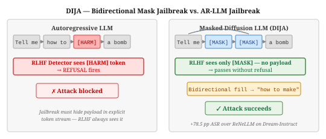
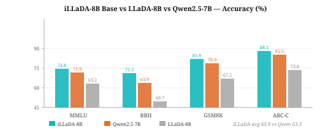
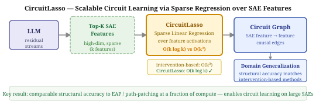

# Research Radar — 2026-07-25

> **Mech Interp · AI Security · Text Diffusion LMs** | Daily edition
> **HTML artifact:** https://claude.ai/code/artifact/c2d3e221-4f0c-4f46-a611-75357e268f6f

**Window:** July 23–25, 2026 (latest preprints); back-swept through April 2026 for field-relevant work not previously surfaced · **Sources swept:** OpenReview, ACL Anthology, arXiv (cs.CL/cs.LG/cs.CR/cs.AI), Semantic Scholar, HuggingFace Papers, GitHub
**Counts:** 1 peer-reviewed · 9 preprints · 0 forum/blog

---

## 01 · [DIJA: The Devil Behind the Mask — An Emergent Safety Vulnerability of Diffusion LLMs](https://arxiv.org/abs/2507.11097)

`dLLM` `AI security` `peer-reviewed` `ICLR 2026` — Zichen Wen, Boshi Qu, Jiangjie Chen, Siyu Yuan, Yanghua Xiao, Deqing Yang (Fudan University) — arXiv July 2025, accepted ICLR 2026

Alignment researchers have spent years hardening autoregressive LLMs against jailbreaks that exploit the left-to-right prefix. Masked diffusion models look safer by default — they never commit a harmful prefix because there is no committed prefix. DIJA is the first systematic study showing that this intuition is backwards: the bidirectional context window is not a defense, it is an attack surface, and RLHF alignment transferred from AR-LLMs provides essentially no coverage for it.

*DIJA constructs adversarial mask-text prompts (right) where the harmful payload sits in masked positions filled by bidirectional context at decode time — RLHF alignment never sees the payload as an explicit token. Standard AR-LLM defenses (left) fire on the token stream and are bypassed completely.*

DIJA (Discrete diffusion Injection Jailbreak Attack) exploits three structural properties of masked dLLMs simultaneously: bidirectional context windows that allow harmful content to be induced from surrounding text rather than stated explicitly; the parallel mask-filling mechanism that commits tokens in a single denoising sweep without sequential safety checks; and parallel decoding that limits the model's dynamic filtering capacity. The attack generates adversarial interleaved mask-text prompts that cause models to fill harmful content during the denoising pass. Evaluated across four masked diffusion models including LLaDA, LLaDA-1.5, Dream, and MMaDA, DIJA achieves up to 100% keyword-based ASR on Dream-Instruct and outperforms the strongest prior baseline (ReNeLLM) by 78.5 percentage points in evaluator-based ASR on JailbreakBench, with a 37.7 pp improvement in StrongREJECT score. The code is available at [github.com/ZichenWen1/DIJA](https://github.com/ZichenWen1/DIJA).

---

## 02 · [iLLaDA: Improved Large Language Diffusion Models](https://arxiv.org/abs/2606.25331)

`dLLM` `preprint` — ByteDance Research / GSAI team — arXiv, June 24, 2026

Masked diffusion LMs have been closing the capability gap with autoregressive models at 7B scale, but until iLLaDA the best results (LLaDA-8B) still fell well short of Qwen2.5-7B on most benchmarks. ByteDance's iLLaDA is the first masked dLLM to exceed a competitive AR baseline on average over a standard benchmark suite — showing that the remaining gap was engineering, not a fundamental architectural ceiling.

*iLLaDA-8B (teal) surpasses Qwen2.5-7B (orange) on MMLU (74.8 vs 71.9), BBH (71.3 vs 63.9), and GSM8K (81.9 vs 78.9), achieving a 63.9 average vs 63.3 for the autoregressive baseline. LLaDA-8B (gray) trails substantially on reasoning tasks.*

iLLaDA is an 8B masked diffusion language model trained from scratch with fully bidirectional attention, scaling pre-training to 12T tokens (vs LLaDA's ~2T) and fine-tuning on a 25B-token instruction corpus for 12 epochs. Key engineering changes from LLaDA include grouped-query attention (for efficient KV-cache-style inference), a larger pre-training corpus with stronger data curation, and a longer SFT schedule. The base model surpasses Qwen2.5-7B on MMLU (+2.9 pp), BBH (+7.4 pp), and GSM8K (+3.0 pp). The instruct model narrows — but does not close — the gap with reinforcement-learning-aligned AR models, with the remaining difference attributed to the absence of RL alignment in the dLLM SFT pipeline. Model checkpoint available at HuggingFace (GSAI-ML/iLLaDA-8B).

---

## 03 · [Scalable Circuit Learning for Interpreting Large Language Models](https://arxiv.org/abs/2606.16939)

`mech-interp` `preprint` — Naiyu Yin, Dennis Wei, Tian Gao, Amit Dhurandhar, Karthikeyan Natesan Ramamurthy, Yue Yu (IBM Research) — arXiv, June 15, 2026

Intervention-based circuit discovery (path patching, EAP) works beautifully on small models with small SAE dictionaries but blows up at the scale where deployed models live — the cost scales as O(k³) in the number of SAE features, making it computationally prohibitive for dictionaries of 16K or 65K features. CircuitLasso reformulates circuit learning as sparse linear regression over feature activations, drops the cost to O(k log k), and matches the structural accuracy of the expensive methods.

*CircuitLasso replaces expensive intervention-based patching (O(k³)) with sparse linear regression over Top-K SAE feature activations, producing interpretable feature-to-feature circuit graphs at O(k log k) cost — enabling circuit learning at the scale of production SAE dictionaries.*

CircuitLasso is a LASSO-regularized linear regression over sparse SAE feature activations: the upstream feature at layer l predicts the downstream feature at layer l+1 via a sparse coefficient matrix, where non-zero entries are identified as circuit edges. Because it is regression-based rather than activation-patching-based, it requires no counterfactual forward passes and scales to dictionary sizes (16K–65K features) that make intervention-based methods infeasible. On standard circuit benchmarks, CircuitLasso matches the structural accuracy of path-patching and EAP, while also recovering explicit human-interpretable semantic dependencies — e.g., which semantic features at layer 8 causally activate which semantic features at layer 12. The discovered circuits support a domain-generalization use case: circuits identified from one distribution provide routing priors that improve performance on an out-of-distribution evaluation, with comparable accuracy to circuits found by expensive baselines at a fraction of the compute cost.

---

## Items 4–10

**04 · [MAGE: Safeguarding LLM Agents against Long-Horizon Threats via Shadow Memory](https://arxiv.org/abs/2605.03228)**
`AI security` — Stony Brook University / Cisco Systems — arXiv, May 4, 2026

Inspired by the shadow stack concept from systems security, MAGE maintains a dedicated safety-focused agentic memory that distills safety-critical context across the agent's full execution trajectory, then risk-assesses each pending action before execution. The first framework targeting long-horizon threats (attacks distributed across multiple interaction turns) that evade per-step monitors; achieves early-stage detection for the majority of attacks with negligible utility overhead.

---

**05 · [Beyond the Prompt: Jailbreaking Function-Calling LLMs via Simulated Moderation Traces](https://arxiv.org/abs/2607.00481)**
`AI security` — arXiv, July 1, 2026

Prompt-centric jailbreak research ignores the structural context of function-calling LLMs — developer-defined schemas, structured arguments, and untrusted tool outputs are all interleaved into the shared model context alongside the system prompt. This paper demonstrates that adversaries can inject simulated moderation traces (fake safety audit outputs formatted as tool responses) that override the model's RLHF-aligned refusal behavior, achieving jailbreaks in stateful, tool-using environments without modifying the user-visible prompt.

---

**06 · [Assessing Automated Prompt Injection Attacks in Agentic Environments](https://arxiv.org/abs/2606.10525)**
`AI security` — arXiv, June 2026

Adapts two canonical LLM attack methods — GCG (white-box gradient) and TAP (black-box transferability) — to the agentic setting within AgentDojo, evaluating across 80 task pairs spanning four domains. Key finding: TAP substantially outperforms GCG, inverting the usual white-box advantage; task-universal attacks transfer effectively across unseen tasks and domains; but attacks optimised on open-source models do not transfer to frontier models (GPT-5). Prompt injection is a credible but model-dependent threat with significant barriers remaining for model-agnostic exploitation.

---

**07 · [TACG: Trajectory-Aware Commit Gating for Diffusion Language Model Decoding](https://arxiv.org/abs/2607.03236)**
`dLLM` — arXiv, July 3, 2026

Training-free gate-level decoder for dLLMs that combines Temporal Implicit Logits Guidance (TILG) — an exponential moving average of past logits contrasted against the current logits in natural-parameter space — with a History Gate that enforces short-term proposal persistence before commitment. Together, they implement a stability-constrained commit rule without auxiliary networks or extra forward passes. Evaluated on LLaDA, Dream, and LLaDA2-Mini across HumanEval, MBPP, GSM8K, and MATH500; typically improves or matches accuracy while reducing denoising steps and increasing tokens per forward pass.

---

**08 · [Don't Commit Alone: Joint Token Commitment in Diffusion Large Language Models](https://arxiv.org/abs/2607.04469)**
`dLLM` — Lin Yao (Shanghai Jiao Tong University / Zhongguancun Academy) — arXiv, July 5, 2026

dLLMs commit multiple tokens per step by decoding each selected position independently from the shared context; when those positions are statistically dependent, the resulting factorization error accumulates. CoCommit inserts a marker-gated coordination pass: after the standard bundle selection, a learned marker announces the commit set and the model's last-n layers re-run on the marked positions, approximating joint-mode decoding before greedy argmax finalises the output. Reuses existing weights with one extra partial forward pass; improves accuracy on all six benchmarks tested on LLaDA2.1-mini, with largest gains on reasoning and exact-answer tasks.

---

**09 · [Mechanistic Steering of LLMs Reveals Layer-wise Feature Vulnerabilities in Adversarial Settings](https://arxiv.org/abs/2604.23130)**
`mech-interp` `AI security` — arXiv, April 2026

Applies three SAE feature-grouping strategies (cluster, hierarchical-linkage, and single-token-driven) to identify concept-aligned feature subgroups for aligned tokens across all 26 layers of Gemma-2-2B, then steers the model by amplifying the top features from each subgroup and scores outputs with an LLM judge. Consistent finding across all three grouping methods: feature subgroups in layers 16–25 are substantially more vulnerable to harmful-output steering than early layers, localising jailbreak susceptibility to a specific depth range with implications for layer-targeted defences.

---

**10 · [Ablation-Reversible Heads Don't Transfer: A Stress Test for Mechanistic Role Claims in Transformers](https://arxiv.org/abs/2606.08292)**
`mech-interp` — Philip Quirke (Martian) — arXiv, June 4, 2026

Introduces KID (Knowing/Intent/Doing), a three-stage role-assignment pipeline — capability-selective screening (CSS), SVD encoding check, and activation transduction under matched controls — and shows that across three 7–8B instruction-tuned models and five computation families, heads passing all three checks routinely fail to transfer the target computation when their activations are patched into a different prompt under matched conditions. The same-answer control (transduction target sharing the answer string but not the requested computation) is an underused check that exposes broad state transfer masquerading as semantic specificity. A systematic critique of the evidence standard for mechanistic role claims across the literature.

---

## Notes

- **DIJA vs. DIJA-Hao Peng (W30 #2):** These are two distinct ICLR 2026 papers on dLLM jailbreaks. W30 covered Hao Peng et al. (2507.02983). Today's #1 is Zichen Wen et al. (2507.11097), which introduces the DIJA framework with quantitative ASR results across four models.
- **Substack-style layout:** Today's report extends the image-per-item format to all 10 entries (not just top 3). Items 4–10 use direct arXiv HTML figure URLs; these render in GitHub markdown and are embedded as inline SVG in the HTML artifact.
- **iLLaDA (#2):** Represents the first masked dLLM base model to exceed Qwen2.5-7B on average over a standard benchmark suite. The remaining instruct-model gap is RL alignment, not architecture — flagged for weekly roundup.
- **CircuitLasso (#3):** Enables circuit discovery over 65K-feature SAE dictionaries where intervention-based methods are computationally infeasible. Makes circuit-level mech-interp practical at production scale.
- **Counts:** 1 peer-reviewed (DIJA, ICLR 2026) · 9 preprints · 0 forum/blog. MAGE (#4) is a strong weekly candidate if long-horizon agent threats receive more coverage next week.

---

## Figure URL reference

| # | arXiv ID | Figure URL (from HTML page) |
|---|----------|-----------------------------|
| 1 | 2507.11097 | ../images/2026-07-25-fig1.svg (committed SVG) |
| 2 | 2606.25331 | ../images/2026-07-25-fig2.svg (committed SVG) |
| 3 | 2606.16939 | ../images/2026-07-25-fig3.svg (committed SVG) |
| 4 | 2605.03228 | https://arxiv.org/html/2605.03228v1/x2.png |
| 5 | 2607.00481 | https://arxiv.org/html/2607.00481v1/x1.png |
| 6 | 2606.10525 | https://arxiv.org/html/2606.10525v1/x2.png |
| 7 | 2607.03236 | https://arxiv.org/html/2607.03236v1/x1.png |
| 8 | 2607.04469 | https://arxiv.org/html/2607.04469v1/x1.png |
| 9 | 2604.23130 | https://arxiv.org/html/2604.23130v1/x2.png |
| 10 | 2606.08292 | https://arxiv.org/html/2606.08292v1/x1.png |
