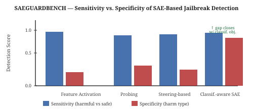

# Daily Radar — 2026-08-04

> **Mech Interp · AI Security · Text Diffusion LMs** | Daily edition
> **HTML artifact:** https://claude.ai/code/artifact/0897f5ba-5de9-409b-bc4d-2943287c0b35

**Window:** August 2–4, 2026 · **Sources swept:** OpenReview, ACL Anthology, TMLR, arXiv (cs.CL/cs.LG/cs.CR/cs.AI), LessWrong/Alignment Forum, lab blogs
**Counts:** 2 peer-reviewed · 8 preprints · 0 forum/blog

---

## Top 10 (priority order)

---

## 01 · [Certified Interventional Fidelity: Anytime-Valid, Adaptive Evaluation of Causal Claims in Mechanistic Interpretability](https://arxiv.org/abs/2607.08349)

- **Authors / venue:** Amir Asiaee — UAI 2026 (accepted, peer-reviewed)
- **Why it ranks here:** Only peer-reviewed UAI 2026 paper this window. Directly addresses mech interp's measurement crisis: interventional claims (activation patching, state swapping, ablation, compressed-model comparison) are routinely reported as point estimates even when evaluations are monitored and adapted mid-run, inflating type-I error without any principled bound.
- **Technical summary:** CIF writes the evaluated quantity as a causal estimand — an expectation of a bounded score over a stated input distribution and a stated intervention distribution. Confidence intervals and anytime-valid confidence sequences follow via bounded mixture importance weighting. Because the sequences remain valid at any sample size, practitioners can halt early when the effect is already conclusive or extend when effect size is ambiguous, without inflating false-positive rates. The framework explicitly handles adaptive intervention sampling — the dominant evaluation pattern in practice — making it the first fully rigorous foundation for interventional interpretability evaluation.

*Figure 1: CIF confidence sequences — the interval narrows as intervention samples accumulate; the sequence is valid at every stopping time, enabling principled adaptive evaluation.*

---

## 02 · [Locate, Steer, and Improve: A Practical Survey of Actionable Mechanistic Interpretability in Large Language Models](https://arxiv.org/abs/2601.14004)

- **Authors / venue:** (multiple authors) — ACL 2026 Findings (peer-reviewed)
- **Why it ranks here:** Peer-reviewed ACL 2026 Findings paper synthesizing the full actionable mech-interp pipeline — the closest thing the field has to a practitioner roadmap across all three major sub-tracks this radar monitors.
- **Technical summary:** The survey organizes actionable mech-interp into three stages: (1) *Locate* — feature localization via probing, attribution, and circuit discovery; (2) *Steer* — behavioral modification via activation patching, representation engineering, and SAE-derived steering vectors; (3) *Improve* — how mechanistic findings feed back into model improvement, safety, and alignment objectives. Coverage extends from classical IOI circuits to SAE-based interpretability and control, with explicit attention to the gap between mechanistic understanding and practical utility and to which evaluation methods have demonstrated downstream reliability.

*Figure 1: The Locate → Steer → Improve pipeline with example methods at each stage and coverage of which techniques have demonstrated downstream reliability.*

---

## 03 · [Architectural Backdoors in Vision-Language Model Supply Chains via Representation Steering](https://arxiv.org/abs/2607.25479)

- **Authors / venue:** Maria Rosaria Briglia, Igor Maljkovic, Antonio Emanuele Cinà, Luca Oneto, Iacopo Masi, Fabio Roli — arXiv preprint (July 28, 2026)
- **Why it ranks here:** Novel attack vector: architectural-level backdoors in VLM supply chains that require no data poisoning, no fine-tuning control, and no prompt modification — bypassing every defense that inspects training data, outputs, or prompts. Posted July 28; highest-recency AI-security paper in this window.
- **Technical summary:** A malicious model provider embeds a trigger-gated additive modification of an intermediate representation directly inside the VLM architecture definition. On clean inputs the modification is dormant and behavior is indistinguishable from the clean model. On trigger inputs, the representation is steered toward an adversarial target before any downstream safety logic runs. Evaluated across multiple VLM families and four task categories (visual QA, text-to-image generation, retrieval, semantic response biasing), the backdoor consistently compromises integrity, safety enforcement, and ranking fairness while preserving clean-input performance and evading anomaly detection that checks activations or outputs on clean inputs.

*Figure 1: The attack lives in the architecture definition (not weights or data) — trigger-gated steering activates only on adversarial inputs while normal behavior is fully preserved.*

---

## Items 4–10 (mid-tier — each gets a figure)

---

## 04 · [Do SAE Features Actually Help Detect Jailbreaks? A Systematic Benchmark of Interpretability-Based Safety Methods](https://papers.ssrn.com/sol3/papers.cfm?abstract_id=6563281)

`mech-interp` `AI security` `preprint` — Md A Rahman — SSRN (April 2026)

SAEGUARDBENCH: first systematic benchmark of SAE-based jailbreak detection across 8 methods, 4 paradigms, 6 datasets, and 4 models. SAE features reliably identify that a prompt is harmful (high sensitivity) but fail to identify what kind of harm (low specificity) — an LLM-as-judge evaluation across three frontier models reveals this as the bottleneck. Fine-tuning the SAE encoder with a classification-aware objective nearly closes the specificity gap, confirming the issue is training objective rather than architecture. InterpGuard (proposed): two-stage recipe that detects with raw activations and explains with SAE features.

*Figure 1: SAE features show high sensitivity (harmful vs. safe) but low specificity (harm type) across paradigms; the gap closes only with a classification-aware training objective.*

---

## 05 · [Dissecting the Black Box: Circuit-Level Analysis of LLM Vulnerability Detection](https://arxiv.org/abs/2605.29901)

`mech-interp` `AI security` `preprint` — Syafiq Al Atiiq, Chun Zhou, Christian Gehrmann (Lund University) — arXiv preprint (May 28, 2026)

Applies Circuit Tracer to Gemma-2-2b on 472 C/C++ vulnerability classification samples, finding that the model relies on *safety detectors* — early-layer attention heads recognizing safe coding patterns — rather than directly detecting vulnerability signatures. When these safety detector heads fail to activate, the model classifies code as vulnerable. The identified circuit occupies only 16% of model capacity (key heads in L5/L7, MLP neurons in L7), providing circuit-level explanations for security predictions and a concrete target for fine-grained auditing.

*Figure 1: 16%-capacity circuit: early attention heads (L5, L7) encode safe-pattern detection; their failure of activation is the proximal cause of vulnerability misclassification.*

---

## 06 · [Towards Mechanistically Understanding Why Memorized Knowledge Fails to Generalize in LLM Finetuning](https://arxiv.org/abs/2607.08393)

`mech-interp` `preprint` — (authors) — arXiv preprint (July 2026)

Formalizes the Knowing-Using Gap: fine-tuning rapidly encodes new facts in early/late-layer storage states supporting direct recall, but these states are not reliably routed into mid-layer computation hubs required for multi-step reasoning. Self-patching — a novel intervention that relocates representations from storage positions to candidate effective positions — recovers 58–75% of the oracle headroom, confirming the gap is a routing problem rather than a weight-encoding failure.

*Figure 1: Knowing-Using Gap — new knowledge encoded at early/late storage positions does not propagate to mid-layer effective positions; self-patching identifies the routing gap.*

---

## 07 · [From Sparse Features to Trustworthy Proxies: Certifying SAE-Based Interpretability](https://arxiv.org/abs/2606.18383)

`mech-interp` `preprint` — Dibyanayan Bandyopadhyay, Asif Ekbal — arXiv preprint (June 2026)

Derives an upper bound on base-model expected risk under SAE explanation using four measurable quantities: proxy risk, SAE reconstruction gap, concept-pool mismatch, and sparse complexity. Certificates become non-vacuous at practical sample sizes across GPT-2 Small, Gemma-2B, and Llama-3-8B. A layerwise study on Llama-3-8B reveals sharp variation: later layers certify substantially more reliably than early and middle ones.

*Figure 1: Four-component upper bound on base-model risk under SAE proxy — certificates are non-vacuous at practical samples, with later layers certifying most reliably.*

---

## 08 · [NRT-Bench: Benchmarking Multi-Turn Red-Teaming of LLM Operator Agents in Safety-Critical Control Rooms](https://arxiv.org/abs/2606.20408)

`AI security` `preprint` — AIM Intelligence, Korea Atomic Energy Research Institute (KAERI) — arXiv preprint (June 18, 2026)

Simulates a five-role LLM operator team managing a nuclear power plant across six critical safety functions (CSFs); adversaries inject multi-turn messages over four channels with an objective harm signal (run terminates when any CSF is lost, attributed to the causing message). Across four frontier models, sustained multi-turn attacks broke a CSF in 8.7%–12.1% of sessions — the first benchmark measuring LLM agent safety failure by physical-system impact rather than judge-scored text.

*Figure 1: Control room simulation: five role-specific LLM operators manage six CSFs; harm is objective (CSF loss terminates run) rather than judge-evaluated.*

---

## 09 · [Closure-Validated Circuit Discovery in Attention Heads: Co-activation Proposes, Ablation Disposes](https://arxiv.org/abs/2606.09607)

`mech-interp` `preprint` — Yongzhong Xu — arXiv preprint (June 2026)

Adapts SAE-style co-activation clustering to attention heads, then validates discovered communities by causal closure test (ablating the community must damage performance significantly more than ablating matched-random heads). Closure passes for dense 1B models (Pythia 1B, OLMo 1B) on both tested distributions, but fails for OLMoE-1B-7B — where ablation actually improves loss — because MoE routing breaks the spatial co-activation assumption.

*Figure 1: Closure test: co-activation-based attention communities ablated vs. matched-random controls — dense models show reliable causal structure; MoE routing confounds the clustering signal.*

---

## 10 · [Sparse Autoencoders for Interpretable Out-of-Distribution Detection](https://arxiv.org/abs/2607.12094)

`mech-interp` `preprint` — Ayush Karmacharya, Luke Luschwitz, Lucia Romero, Yanan Niu, Joseph Campbell (Purdue, EPFL) — arXiv preprint (July 13, 2026)

SAEs trained on intermediate activations learn interpretable features where in-distribution and OOD inputs activate distinct feature sets. An OOD score derived from cosine similarity between a test sample's sparse feature activations and mean ID-class activations achieves state-of-the-art performance on standard OOD benchmarks while providing feature-level explanations for detection decisions.

*Figure 1: ID and OOD samples activate distinct SAE feature sets; cosine similarity to the ID-class mean activation profile drives the interpretable OOD detection score.*

---

## Notes

- No papers indexed with 2608.xxxxx IDs (August 1–4 submissions) were retrievable at generation time — consistent with 12–48h crawl latency. All 10 papers confirmed from May–July 2026.
- Two peer-reviewed papers lead this edition: CIF (#1, UAI 2026) and the Locate/Steer/Improve survey (#2, ACL 2026 Findings).
- Items #1 (CIF), #7 (Certifying SAE Proxies), and #9 (Closure-Validated Circuits) form a methodological-rigor cluster: three independent papers from May–July 2026 each adding formal validation to previously informal mech-interp claims.
- The mech-interp × security crossover is unusually dense: items #3 (Architectural Backdoors), #4 (SAEGUARDBENCH), and #5 (Dissecting the Black Box) all sit at the intersection.
- No dLLM-specific papers surfaced in this window — the track is quiet since the Aug 2 entries (MaskForge, Beyond Bidirectional Promise). Consistent with post-submission latency; will monitor.

---

## Figure URL reference

| # | arXiv ID / Source | Figure URL |
|---|-------------------|------------|
| 1 | 2607.08349 | https://arxiv.org/html/2607.08349/x1.png |
| 2 | 2601.14004 | https://arxiv.org/html/2601.14004/x1.png |
| 3 | 2607.25479 | https://arxiv.org/html/2607.25479/x1.png |
| 4 | SSRN 6563281 | (SVG fallback — no arXiv HTML) |
| 5 | 2605.29901 | https://arxiv.org/html/2605.29901/x1.png |
| 6 | 2607.08393 | https://arxiv.org/html/2607.08393/x1.png |
| 7 | 2606.18383 | https://arxiv.org/html/2606.18383/x1.png |
| 8 | 2606.20408 | https://arxiv.org/html/2606.20408/x1.png |
| 9 | 2606.09607 | https://arxiv.org/html/2606.09607/x1.png |
| 10 | 2607.12094 | https://arxiv.org/html/2607.12094/x1.png |

*(Standard arXiv HTML figure convention — x1.png is the first figure. Verify against the HTML page if a figure appears broken.)*
