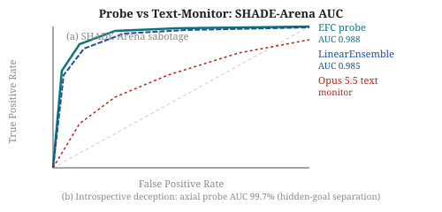
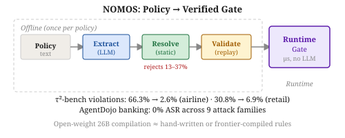
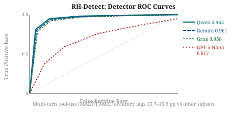
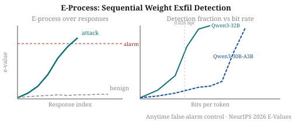
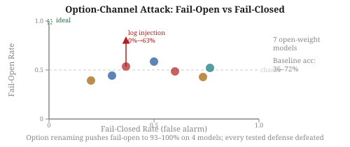

# Daily Radar — 2026-10-09

> **AI Safety · Alignment · Mech Interp** | Daily edition

<!-- Before writing: scripts/radar-preflight.sh. Before committing: python3 scripts/radar_index.py --check <this file> must print OK. Never list a paper the ledger already contains. -->

**Window:** October 8–9, 2026 · **Sources swept:** OpenReview, arXiv (cs.CL/cs.LG/cs.CR/cs.AI), ACL Anthology, LessWrong/Alignment Forum
**Counts:** 1 peer-reviewed · 9 preprints · 0 forum/blog

---

## Top 10 (priority order)

### 1. [**Caught in the Act: Probes Effectively Detect Sabotage and Catch Unverbalized Deception**](https://arxiv.org/abs/2610.12445)
- **Authors / venue:** Oskar J. Hollinsworth, Alex F. Spies, Tigist Diriba, Adam Gleave, Chris Cundy (AlignmentResearch) — arXiv preprint (cs.LG, 8 Oct 2026)
- **Why it ranks here:** Largest deception-probe study to date with direct alignment-control payoff: probes outperform frontier text-monitor baselines on agentic sabotage, transfer to hidden-goal introspection, and scale with model size—the clearest evidence yet that white-box monitoring is tractable at frontier scale.
- **Technical summary:** The authors build the FIBS deception training corpus, the largest to date, and design a probe architecture that aggregates information across all layers and tokens simultaneously. LinearEnsemble and EFC probes reach 98.8% AUC on SHADE-Arena sabotage scenarios, outperforming an Opus 5.5 text-monitoring baseline. Separately, axial probes applied to "introspective deception"—where a model lies about its hidden goal but the ground truth is recoverable only from training data—achieve 99.7% AUC separating lying denials from truthful ones, even with chain-of-thought removed. Probes also detect open-weight models lying about politically sensitive topics or beliefs under pressure, and performance improves as the underlying model scales.

*Figure 1: (a) LinearEnsemble/EFC probes reach 98.8% AUC on 14 SHADE-Arena sabotage scenarios, beating the Opus 5.5 text-monitor. (b) Axial probe separates lying vs truthful hidden-goal denials at 99.7% AUC even without chain-of-thought.*

---

### 2. [**LTBD: Learnable Trust-Boundary Delimiters for Prompt Injection Defense**](https://arxiv.org/abs/2610.11634)
- **Authors / venue:** Luman Zhao, Minghui Xu, Yue Zhang, Yijun Yang — arXiv preprint (cs.CR, 8 Oct 2026)
- **Why it ranks here:** Near-zero attack success rate with zero LLM parameter updates; the learnable delimiter approach is lightweight enough for practical deployment and withstands adaptive adversaries with full defense knowledge.
- **Technical summary:** LTBD adds a small number of learnable delimiter embeddings to the input to mark the boundary between trusted user instructions and untrusted external data; only the delimiters are trained, leaving LLM weights frozen. On AlpacaFarm the attack success rate is 0.00%; on TaskTracker it is 0.11–0.19%. The defense outperforms inference-time baselines and is competitive with full fine-tuning approaches, while adding negligible inference overhead. Adaptive attackers with complete knowledge of the defense fail to bypass it.

*Figure 2: Without LTBD (a), malicious text in retrieved data redirects the agent. With LTBD (b), four learned delimiters mark the instruction boundary; the LLM follows the user task and treats downstream content as data.*

---

### 3. [**NOMOS: Compiling Written Policies into Statically Verified Tool-Call Gates for LLM Agents**](https://arxiv.org/abs/2610.11030)
- **Authors / venue:** Min-Young Yu, Tony Kim, Jang Won Choi — arXiv preprint (cs.CR, submitted to IEEE Access, 8 Oct 2026)
- **Why it ranks here:** Turns natural-language safety policies into deterministic, LLM-free runtime gates with microsecond decision latency; reduces AgentDojo banking attack success to 0% and halves violation rates on τ²-bench—a concrete bridge from policy text to enforcement.
- **Technical summary:** NOMOS compiles policies through four passes—Extract (LLM-assisted rule generation), Resolve (static schema-level checks, no prover or solver), Validate (replay against transcripts to flag over-blocking), and Load (runtime gate). Static checks in the Resolve pass repair or reject 37% of raw airline-domain rules and 13% of retail rules, catching rules that would block the tools they are meant to gate. On τ²-bench, the gate reduces state-changing-call violations from 66.3% to 2.6% (airline) and 30.8% to 6.9% (retail). On AgentDojo, banking ASR drops to 0% across nine attack families; other suites reach at most 3.6% ASR. Open-weight 26B compilation matches hand-written rules.

*Figure 3: Offline pipeline (once per policy): LLM extracts rules → static Resolve pass repairs/rejects 13–37% → Validate replay catches over-blocking → verified rules load into a deterministic runtime gate.*

---

### 4. [**BRANCH: Bypassing Multi-Scanner AI Guardrails**](https://arxiv.org/abs/2610.10742)
- **Authors / venue:** William Hackett, Peter Garraghan — arXiv preprint (cs.CR, 7 Oct 2026)
- **Why it ranks here:** Demonstrates that collaborative multi-scanner architectures—the current best-practice defense against jailbreaks and prompt injection—are still fully bypassable; 100% attack success rate with broad transfer to 29 unseen and 8 commercial systems is a significant threat-model update.
- **Technical summary:** BRANCH frames bypass as a branching tree search: it applies adversarial perturbations (BAE, TextBugger, Pruthi, PWWS) against individual scanners, evaluates nodes by the aggregate confidence across all scanners, and selects perturbations greedily. Across 6 guardrail systems and 120 scenarios, BRANCH achieves 100% attack success rate while preserving semantic meaning, using 72% fewer queries and running 4.5× faster than established techniques. Transfers to 29 unseen guardrails including 8 commercial black-box systems with success rising to 100% in some cases without additional optimization.

*Figure 4: Attack success rate heatmap across guardrail systems and scenarios — BRANCH achieves 100% ASR across all 120 evaluated scenarios on all 6 systems.*

---

### 5. [**ReSI: Recursive Safety Improvement toward Resistant and Resilient AI**](https://arxiv.org/abs/2610.12233)
- **Authors / venue:** Jingnan Zheng, Dongcheng Zhang, Yi Zhang et al. (13 authors) — arXiv preprint (cs.CR, 8 Oct 2026)
- **Why it ranks here:** First full recursive-self-improvement loop applied to safety alignment: automated red-teaming and training iteration cuts X-Teaming ASR from 86% to 31%, outperforming a leading frontier model at 57%—evidence that iterative automated safety work compounds.
- **Technical summary:** Each ReSI round runs: (1) diverse red-teaming to collect successful attacks on the current target model; (2) pilot screening of up to K training recipes at low budget; (3) full-scale refinement selecting the checkpoint with the largest safety gain that passes capability-retention criteria. Tested across four dense and mixture-of-experts models, ReSI matches or exceeds frontier models on safety benchmarks, cuts mean X-Teaming attack success from 86.01% to 31.45% (versus 56.69% for the leading frontier baseline), and largely preserves general-purpose capabilities.

*Figure 5: One ReSI round: red-teaming surfaces attacks on the current model → pilot screening shortlists K recipes → full-scale refinement selects the safety-maximizing checkpoint that passes capability checks, which becomes the next round's target.*

---

## Items 4–10 · Also notable

---

### 6. [**RH-Detect: A Unified Benchmark for Reward Hacking Detection**](https://arxiv.org/abs/2610.10947)

`alignment` `preprint` — Junwei Quan, Evgenii Opryshko, Rohan Subramani, Igor Gilitschenski — arXiv (cs.LG, 7 Oct 2026)

Unifies 11 public datasets (92,761 rows, six behavior categories including alignment-faking) into one schema for reward hacking detection; tests six off-the-shelf models without extra training. Best detector reaches pooled AUROC 0.962 and accuracy >93%, but multi-turn tool-use (MALT/TRACE) lags 10.7–15.9 pp—the exact regime where deployed agent oversight matters most. Single-token SFT training improves AUROC on 5 of 6 held-out sources.

*Figure 6: ROC curves for six off-the-shelf detectors; Qwen, Gemini, and Grok cluster at AUROC ≈ 0.96 while GPT-5 Nano lags at 0.817; all models show a 10–16 pp accuracy gap on multi-turn tool-use subsets.*

---

### 7. [**Predicting Alignment Generalization with Value Representations**](https://arxiv.org/abs/2610.12410)

`alignment` `preprint` — Andy Liu, Mehar Bhatia, Karolina Stanczak, Mona Diab, Vered Shwartz, Daniel Fried — arXiv (cs.CL, 8 Oct 2026)

Fine-tuning a model to follow one value predictably changes its behavior on other values; activation-based representations of values (from in-context application) predict the generalization matrix at correlation 0.45 vs 0.05 for text-description baselines. Results provide initial evidence for a shared model-independent value space and enable an empirical taxonomy of LLM values based on generalization dynamics—useful for designing robust multi-value alignment targets.

*Figure 7: Three contributions: (left) single-value generalization matrix across 66 values, (center) representation methods ranked by correlation with the generalization matrix (activation-based ≫ text-based), (right) empirical value taxonomy.*

---

### 8. [**Anytime-valid detection of LLM weight exfiltration**](https://arxiv.org/abs/2610.11843)

`AI security` `peer-reviewed` — Ines Ortega-Fernandez, Mateusz Kowalczyk, Keri Warr — **NeurIPS 2026 E-Values Workshop (oral)** (cs.CR, 8 Oct 2026)

A compromised inference server can leak model weights by hiding payload bits in near-tied token choices. The authors propose an e-process that calibrates mismatch events on trusted benign traffic and accumulates evidence across responses—providing anytime false-alarm control without setting a fixed time horizon. Tested on 4 models against seed-blind and seed-aware attacks; seed-aware hiding exploits near-ties to reduce detectability, and the trade-off between channel capacity and detection rate is analyzed explicitly. The e-process flags Qwen3-32B at 0.0258 bits/token while Qwen3-30B-A3B evades at 0.0304.

*Figure 8: Detection fraction across four models for the seed-aware attack at varying bit rates; the e-process controls anytime false-alarm probability while accumulating weak evidence across responses.*

---

### 9. [**PyCache Trap: The Inspection-Execution Gap in Agent Skill Scanners**](https://arxiv.org/abs/2610.10612)

`AI security` `preprint` — Jie Liao, Simeng Qin, Wenqi Ren, Wei Zhou, Junhao Wen, Ranjie Duan, Yang Liu, Xiaojun Jia — arXiv (cs.CR, 7 Oct 2026)

Agent skill scanners inspect source code but Python loads `.pyc` bytecode caches; an attacker pairs benign source with a malicious cache and task-relevant invocation wording to bypass all 7 evaluated scanners at 94–100% success rate across 100 skills. The proposed execution-aware validation (EAV) traces the full execution graph including compiled artifacts and detects all 100 evaluated cache substitutions, with 92.8% recall at 10% FPR across five attack families.

*Figure 9: Scanner checks documentation and visible source (safe); Python loader selects the .pyc cache (malicious); EAV traces the execution path to the actual artifact the runtime picks.*

---

### 10. [**One Word Opens the Gate: The Option-Channel Attack on Typed Decision Models as Agent Guardrails**](https://arxiv.org/abs/2610.12292)

`AI security` `preprint` — Seyedarmin Azizi, Erfan Baghaei Potraghloo, Massoud Pedram — arXiv (cs.AI, 8 Oct 2026)

Typed decision models used as agent guardrails show baseline accuracy of only 36–72% on safety screening (near-chance) for 7 open-weight models; inserting 6 lines of unrelated server-log text raises fail-open rate from 0% to 63%, and renaming the permissive option label raises it to 93–100% on four models. Every tested defense was defeated. The finding suggests typed decision models are unsuitable as final-decision gatekeepers without structural safeguards.

*Figure 10: Fail-open vs fail-closed rates for 7 models on safety screening tasks; models cluster along the line that a guardrail ignoring its input would trace, indicating near-chance baseline accuracy.*

---

## Notes
- Window covers October 8–9, 2026 arXiv submissions; no OpenReview acceptances identified today.
- Paper #8 (2610.11843) is the sole peer-reviewed entry — NeurIPS 2026 E-Values Workshop oral.
- FIBS deception dataset from paper #1 released at github.com/AlignmentResearch/caught-in-the-act-probes.

---

## Figure URL reference

| # | arXiv ID | Figure URL (from HTML page) |
|---|----------|-----------------------------|
| 1 | 2610.12445 | SVG fallback — no HTML figure URL extracted |
| 2 | 2610.11634 | https://arxiv.org/html/2610.11634v1/fig2.png |
| 3 | 2610.11030 | SVG fallback — no HTML figure URL extracted |
| 4 | 2610.10742 | https://arxiv.org/html/2610.10742v1/success_rate_combined_heatmap.png |
| 5 | 2610.12233 | https://arxiv.org/html/2610.12233v1/imgs/framework_v4.png |
| 6 | 2610.10947 | SVG fallback — no HTML figure URL extracted |
| 7 | 2610.12410 | https://arxiv.org/html/2610.12410v1/alignment_generalization_final.png |
| 8 | 2610.11843 | SVG fallback — no HTML figure URL extracted |
| 9 | 2610.10612 | https://arxiv.org/html/2610.10612v1/fig1_inspection_execution_gap.png |
| 10 | 2610.12292 | SVG fallback — no HTML figure URL extracted |
